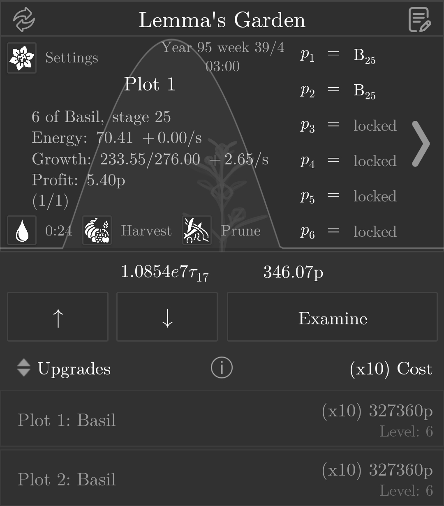
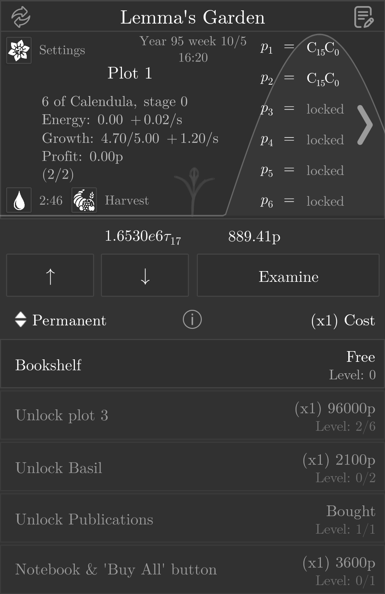

# Lemma's Garden

> Last night, Lemma swept away the leaves and rubbles on her old garden.
> 
> You are her first student in a long while.

Welcome to Lemma's Garden, an idle botanical theory built on the workings of Lindenmayer systems. Reminisce the story of Lemma, a retired teacher, and her late partner, as she rambles about things already long passed.

## Installation

### 1. Install the Exponential Idle application.

Links: [Android](https://play.google.com/store/apps/details?id=com.conicgames.exponentialidle), [iOS](https://apps.apple.com/us/app/exponential-idle/id1538487382).

### 2. Acquire a dedicated save file for custom theories.

This step is only for first-time players of Exponential Idle.

Navigate to [`save.txt`](./save.txt) then click on `Raw`. You will be delivered to the dedicated save file. Copy the entire body of text.

Launch Exponential Idle, head to `Settings > Import/Export` and click on `Import from Clipboard`.

Confirm that `Lifetime f(t)` is equal to $ee44000.9.

Import the save.

### 3. Install Lemma's Garden.

Navigate to [`theory.js`](./theory.js) then click on `Raw`. You will be delivered to the source code of this theory. Copy the page's URL.

Then, access the custom theory panel within Exponential Idle using the bottom arrows, until you reach a screen saying `Tap to select a custom theory`. Enter the menu, Press the `+` sign and paste in the URL.

### 4. Tap on 'Lemma's Garden' and start playing.

## Screenshots

> Basil, meet bloom.

> Colony management.
