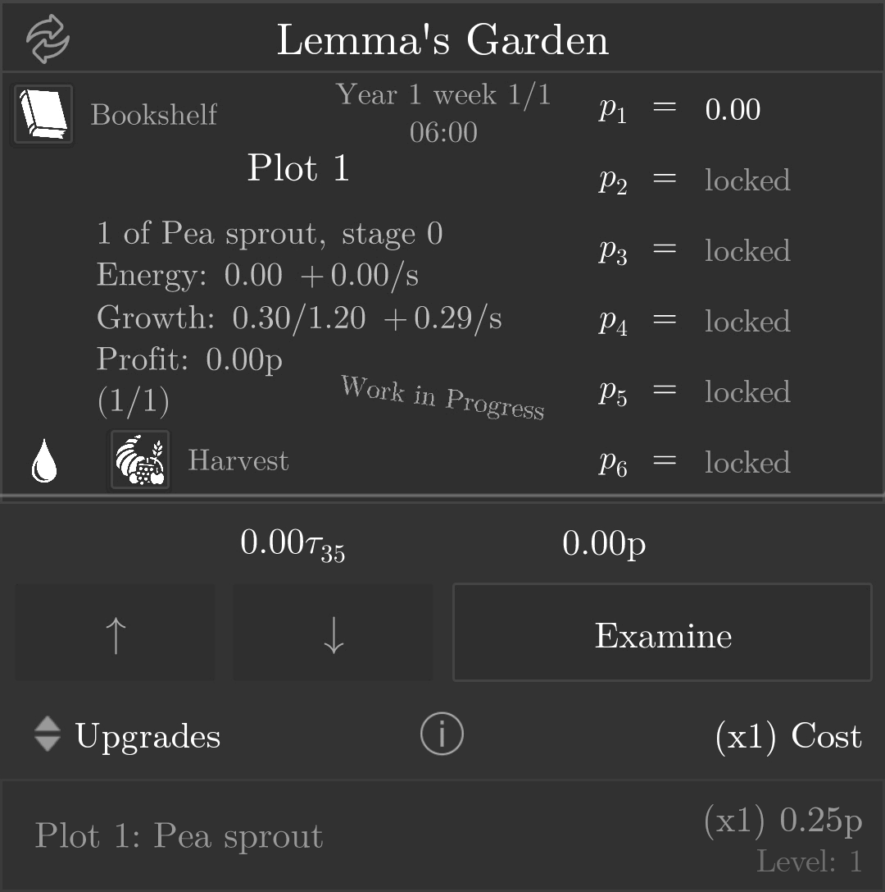
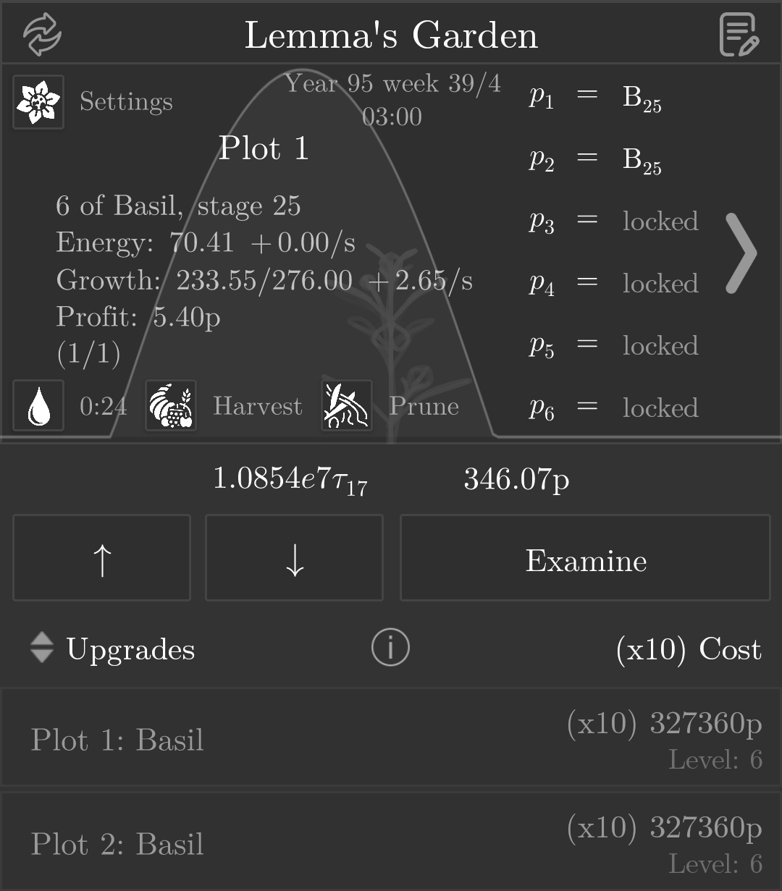
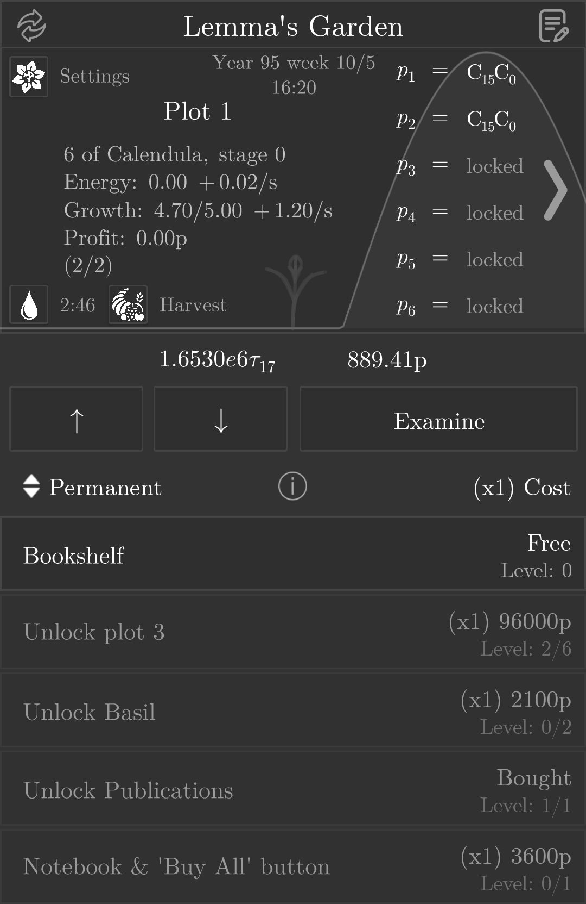

# Lemma's Garden

> Last night, Léa had swept away the long-fallen leaves, the dead rats, and then any visible debris left on her old garden.
>
> You have been her first student in such a long while.

Welcome to Lemma's Garden, an idle botanical theory built on the workings of Lindenmayer systems. Reminisce the story of a retired teacher as she rambles about things long passed.

## Installation

### 1. Install the Exponential Idle application.

Links: [Android](https://play.google.com/store/apps/details?id=com.conicgames.exponentialidle), [iOS](https://apps.apple.com/us/app/exponential-idle/id1538487382).

### 2. Acquire a dedicated save file for custom theories.

This step is only for first-time players of Exponential Idle.

Navigate to [`save.txt`](./save.txt) then click on `Raw`. You will be delivered to the dedicated save file. Copy the entire body of text.

Launch Exponential Idle, head to `Settings > Import/Export` and click on `Import from Clipboard`.

Confirm that `Lifetime f(t)` is equal to $ee44000.9.

Import the save.

### 3. Install the theory.

Navigate to [`theory.js`](./theory.js) then click on `Raw`. You will be delivered to the source code of this theory. Copy the page's URL.

Then, access the custom theory panel within Exponential Idle using the bottom arrows, until you reach a screen saying `Tap to select a custom theory`. Enter the menu, press the `+` sign and paste in the URL.

### 4. Tap on it to start playing.

Tips:
- Seeds have exponentially scaling costs when you buy them. Try not to make a loss from your plant, by comparing its cost to the base profit times your publication multiplier.
- Photosynthesis outscales growth once the peak (noon) photosynthetic rate exceeds two times the average growth rate.
- Unlocked plants always require watering to grow. Hold off watering to keep the plant at the current stage.
- The speed setting can be accessed through the Bookshelf if one finds the theory too slow.

## Screenshots

> Pea sprout.

> Basil, meet bloom.

> Colony management.
