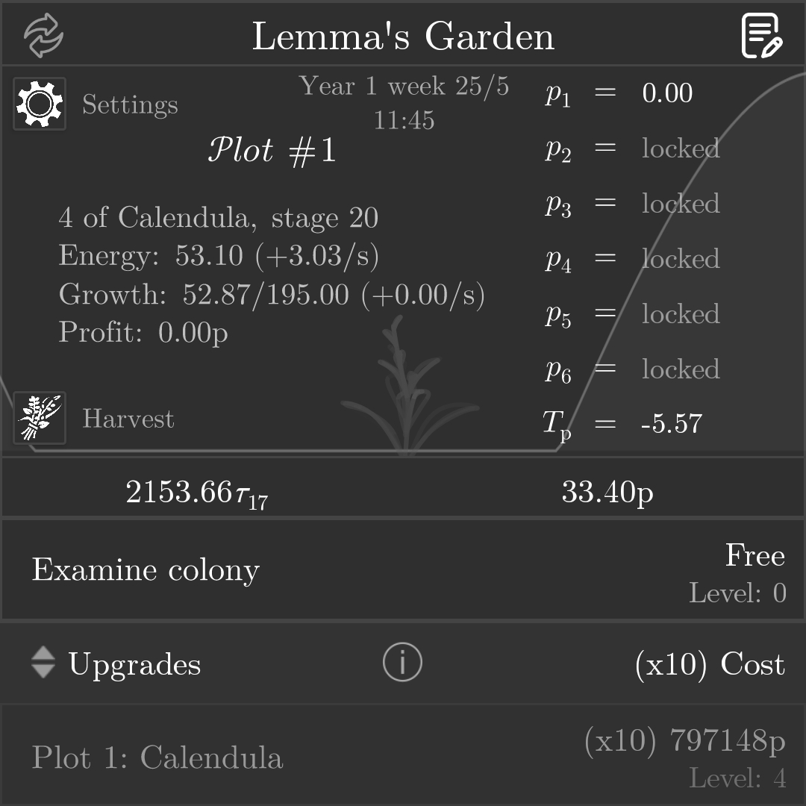

# Lemma's Garden

> Last night, Lemma didn't sweep away the rubbles on her old garden.
> 
> You did. You are her first student in a long while.

Welcome to Lemma's Garden, an idle gardening game built on the grammar of
Lindenmayer systems.

Reminisce the story of Lemma and her late partner as she rambles about how much
she wants to refuse supporting your study with her tight budget. Crap.

## Installation

Navigate to [`theory.js`](./theory.js) then click on `Raw`. You will be
delivered to the raw code page of this theory. Copy the page's URL.

Then, access the custom theory panel within the game (unlocked after finishing
T9, the last theory) then enter the picking menu. Press the `+` symbol and
paste the URL in.

## Screenshots

> Purple calendula alarm.